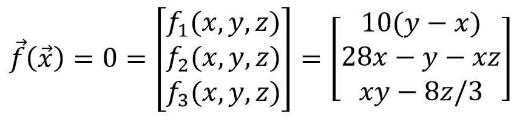
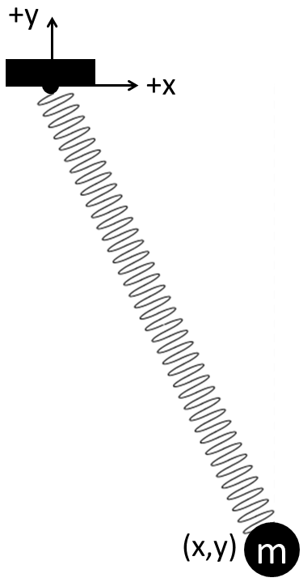
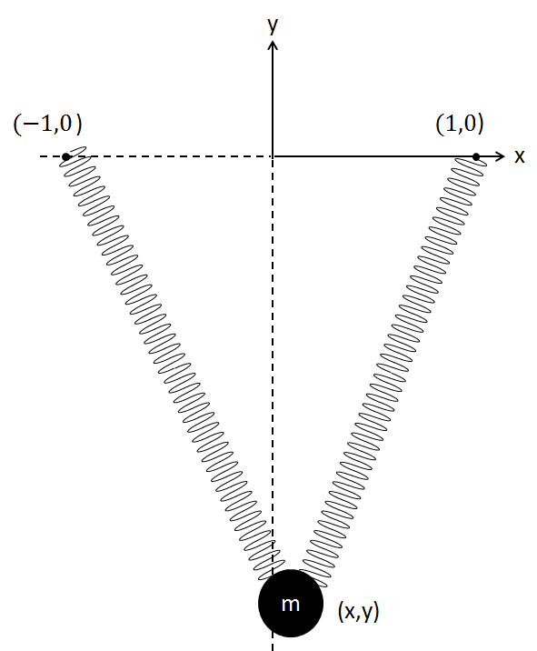

# hw_nonlineareqs
Nonlinear equations, Garcia Section 4.3

  
*   [Problem 1 (in-class)](#2)
*   [Problem 2 (in-class)](#3)
*   [Problem 3 (homework)](#4)
*   [Problem 4 (homework)](#5)

## Problem 1 (in-class)
Write a short <tt>MATLAB</tt> program to find the three roots of this single-variable nonlinear equation. Prompt the user for an initial guess.  Can you find all 3 roots?

## Problem 2 (in-class)
Write a short program to find the steady-state solutions to the Lorenz atmospheric model.

 *  Define the Jacobian matrix
 *  Use the following initial guesses: (50,50,50), (2,2,2), (5,5,5), (4,4,15)
 *  Set the program to run for 10 iterations.

## Problem 3 (homework)
A spring with constant *k* = 500 N/m is attached at the origin and supports a mass *m* = 5 kg as shown in the image below. The spring has a natural (unstretched) length of *L*,sub>0 = 1.00 m. The mass experiences three forces:
 * Spring force: *F*S = *k(L-L*0).  The direction of the spring force is nonlinear with respect to the mass position <tt>[x y]</tt>. 
 * Gravitational force: *W*y = *mg*.
 * Horizontal drag force: *D*x = 7.5*y*2, where *D*x is in Newtons and *y* is in meters.

Complete the <tt>nlonespring.m</tt> program to solve for the equilibrium position of the 5-kg mass. Use the Newton Raphson method with the following requirements.
 *  Prompt the user for the initial guess for the equilibrium position <tt>[x y]</tt> of the mass.
 *  Update the solution for the equilibrium position using a Newton-Raphson iteration with a while loop.
 *  End the loop when the update in position is less than 10-6 meters OR after the 10th iteration, whichever comes first.
 *  Display the equilibrium position and <tt>norm(dx)</tt> each iteration.
 *  Demonstrate that the program works, for an initial guess of <tt>[x y] = [0.1 -1.1]</tt>.

## Problem 4 (homework)
Two springs support a mass *m* = 5 kg as shown in the image below. 
 *  Spring 1 is attached at coordinate (-1,0) and has a spring constant of *k*1 = 100 N/m.
 *  Spring 2 is attached at coordinate (1,0) and has a spring constant of *k*2 = 150 N/m. 
All coordinate positions are in meters. Both of the springs have a natural (unstretched) length of 1.0 meter.   

Complete the <tt>nltwospring.m</tt> program to solve for the equilibrium position of the 5-kg mass.  Use the Newton Raphson method with the following requirements:
 *  Prompt the user for the initial guess for the equilibrium position <tt>[x y]</tt> of the mass.
 *  Update the solution for the equilibrium position using a Newton Raphson iteration with a while loop.
 *  End the loop when the update in position is less than 10-6 meters OR after the 10th iteration, whichever comes first.
 *  Display the equilibrium position and <tt>norm(dx)</tt> each iteration.
 *  Demonstrate that the program works, for an initial guess of <tt>[x y] = [0 0]</tt>.
